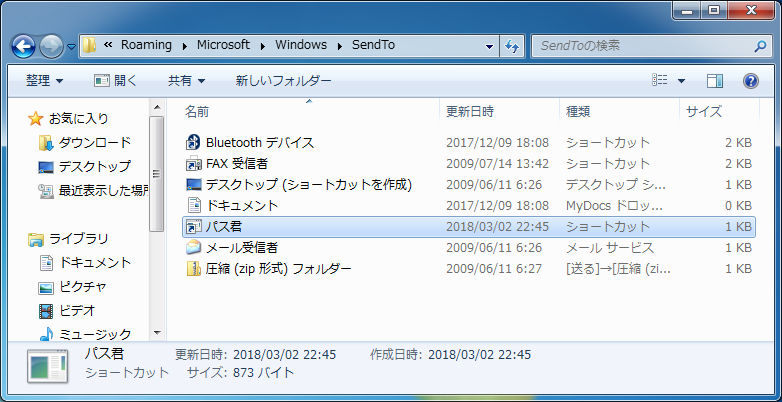
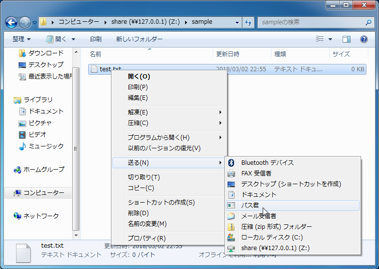
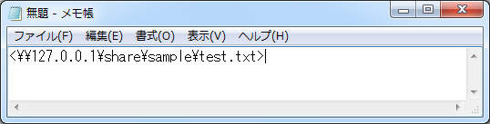

# パス君

## 概要
Windowsのファイルやフォルダのパスをクリップボードにコピーするツールです。

ただパスをコピーするのではなく、各ドライブにネットワークフォルダをマウントしてある場合は、そのパスを展開してくれます。

ファイルのパスを他者と共有したいときに便利なツールです。

クリップボードにコピーするパスは、Outlookに貼り付けたときにリンクのようにさせるため、山カッコで囲んでいます。

## インストール
### プログラムの生成
まず、build.batをダブルクリックして、コンパイルします。

うまくコンパイルできると、path-kun.exeが生成されます。

### コンテキストメニュー > 送る に追加する
エクスプローラーのアドレスバーに、shell:SendTo と入力し、移動します。

自動的に、「送る」フォルダに移動するため、path-kun.exeへのショートカットを設置します。

ショートカットの名称は任意です。ここでは、「パス君」としています。

## 使い方
パスを取得したいフォルダやファイルを右クリックし、[送る] > [パス君] をクリックします。

この例では、Zドライブに `\\127.0.0.1\share` をマウントしてあります。

クリップボードにコピーされる文字列は、以下のようになります。

